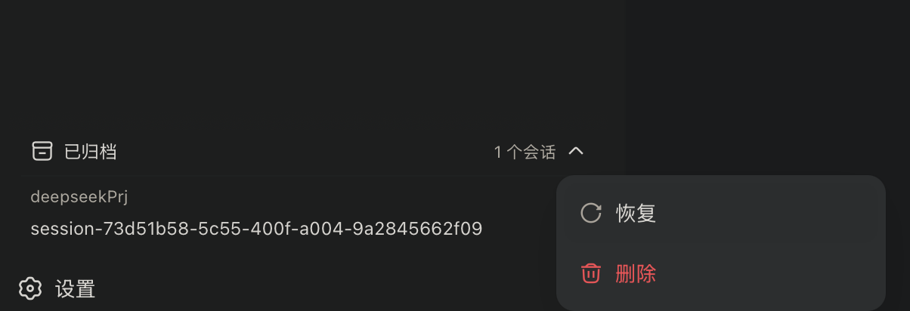

# dsh-archived-sessions

归档会话管理插件（DeepSeek Harness / dsh web shell 用户插件）。

在左侧工作区下方的侧边栏底部分栏新增「已归档」栏目，按工作区分组列出所有归档会话。每个会话条目的交互与工作区列表一致：鼠标悬停出现「…」按钮，点击弹出操作菜单，提供两个操作：

- **恢复** —— 将会话恢复到其工作区（保留原位置），与内置「归档」互为逆操作；
- **删除** —— 彻底删除该会话（日志文件 + 注册表索引 + 工作区槽位 + 归档标记，不可恢复），以红色危险项展示，点击后弹窗二次确认。

> ℹ️ 本目录是插件源码。若尚未安装，按下方「安装」步骤执行；若已安装，升级时重新执行 `dsh plugin add`（`file:` 依赖会刷新）并重启 `dsh web`。

## 界面形态与设计取舍

DSH 的客户端 UI 插槽体系里，侧边栏外壳只对外暴露 3 个插槽：`sidebar.workspaces`（被内置工作区浏览器整体占用）、`sidebar.settings`、`sidebar.footer.action`（列表型，渲染在侧边栏底部、设置按钮上方）。工作区浏览器内部没有可注入的分区，且其运行时组件未随包导出，无法在浏览器内部插入子栏目。

因此本插件把「已归档」栏目挂到 `sidebar.footer.action`：



- **宽模式**：渲染一个可展开/收起的「已归档」区块，位于工作区浏览区域下方、设置行上方，内部按工作区分组列出归档会话（未归属工作区的会话归入「未分组」）。会话条目复用 `@deepseek-ai/dsh-client-ui-primitives` 的 `Menu`/`Modal`：悬停显示「…」（`IconEllipsisOutline16`），点击弹出菜单（恢复 / 删除，删除为 `danger` 红色项 + `Modal` 二次确认），与工作区会话行的交互保持一致；
- **窄条模式**（侧边栏收起时）：退化为一个归档图标按钮，点击会重新展开侧边栏。


## 安装

安装 = 两步：把插件装进 profile（`dsh plugin add` 会把本目录以 `file:` 依赖加入 `~/.dsh/profiles/web/package.json`），再在 `cordis.patch.yml` 里启用它。

**方式一：从 Git 安装（推荐）**

```bash
dsh plugin --profile web add github:joy3mao/dsh-archived-sessions
```

**方式二：本地目录安装**

```bash
dsh plugin --profile web add /file-path/dsh-archived-sessions
```


然后在 `~/.dsh/profiles/web/cordis.patch.yml` 末尾追加（格式与 `better-sidebar` 相同，见同目录 `cordis.patch.example.yml`）：

```yaml
- insert:
    # Archived-session manager: sidebar footer section with restore/delete.
    - id: archived-sessions
      name: 'dsh-archived-sessions'
```

重启 `dsh web`（或触发 HMR）后生效。卸载：删除上面两处并执行 `dsh plugin --profile web remove dsh-archived-sessions`。

## 工作原理

### Host （`lib/index.js`）

- 通过 `ctx.connection.rpc.handle('/archived', ...)` 挂载**专用通道**（`authority: 'trusted-host'`，仅接受已连接 Web 客户端的请求），上面有两个端点：
  - `restore` —— 从 workspace 域的 `archivedSessionIds` 中移除该会话。
  - `delete` —— 彻底删除。
- 为什么不用共享的 `/api`：`/api` 通道被 `dsh-api-gateway` 独占（其拦截器分发所有内置 RPC），且 Connection 只允许一个 `/api` 拦截器；`rpc.handle` 挂载私有通道，不与网关冲突。
- **恢复**走 `WorkspaceRegistry.enqueueOperation → setState`：与内置归档共用同一条写入序列（`operationTail` 串行化 + `recoverPendingMutation` 回放），`setState` 内部先持久化（`domain.global.set`）再刷新注册表内存缓存，并自然触发 `domain/changed` → host 流广播 `host/archived-sessions-changed`，客户端实时更新——**不需要任何私有字段 hack**。
- **删除**按序执行：
  1. 若会话仍附着在内存 `SessionStore`（`ctx.sessions.get(id)` 命中）→ 拒绝（`internal` 错误）。harness 没有任何会话销毁 API，删掉运行中会话的日志文件会破坏其下一次追加；
  2. 删除持久化产物：`sessionPersistence.locate()` 定位 `session.jsonl(.zstd)`，同时清理另一种压缩后缀的孪生文件，目录清空则一并删除；
  3. 清理注册表内存索引（`headers` / `sessionPaths` / `invalidSessionPaths`），使 `sessionKnown` 等判定为确定未命中；
  4. 从归属工作区的 `sessionIds` 槽位摘除（`WorkspaceEntity.detachSession`，持久化并广播 `host/workspace-changed`）；
  5. 从 `archivedSessionIds` 移除（同恢复的写入序列）。


## 已知限制

1. **正在运行的会话不能删除**：`agent.phase.kind !== 'idle'`（running / maintenance）时拒绝删除，这是安全底线——正在写日志的会话删掉文件会破坏写路径。归档后**空闲**的会话（常见的「归档后立刻删除」场景）会被先 flush、再从内存摘除后删除，可正常删除。误删运行中的会话会得到明确的中文错误提示。
2. **持久化残留**：删除只清理会话日志文件与其目录；若未来出现 projection 缓存、telemetry 等独立存储，需另行扩展（本版本未发现独立残留文件）。
3. **`registry.headers` 等内存索引 + `ctx.sessions.store` 为内部字段**：删除流程会直接 `.delete()` 注册表索引、并调用 `SessionStore.store` 条目的 `detach()`（触发 `session/disposed` → 持久化写控制器 retire），依赖 `dsh-workspace` / `dsh-session` 当前字段名，属脆弱点；恢复流程则完全走公开 API，无此问题。
4. **专用 `/archived` 通道**：插件挂载自己的 HTTP 通道，随插件 fiber 装载/卸载；与 `dsh-api-gateway` 的 `/api` 无冲突。
5. **窄条模式**只提供入口按钮（展开侧边栏），不渲染列表。
